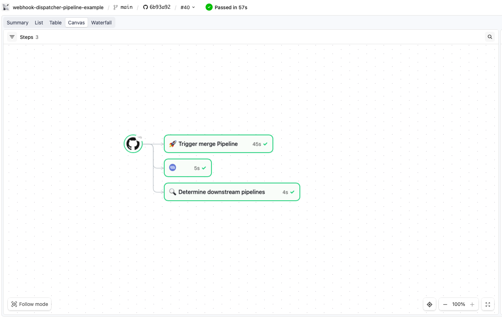
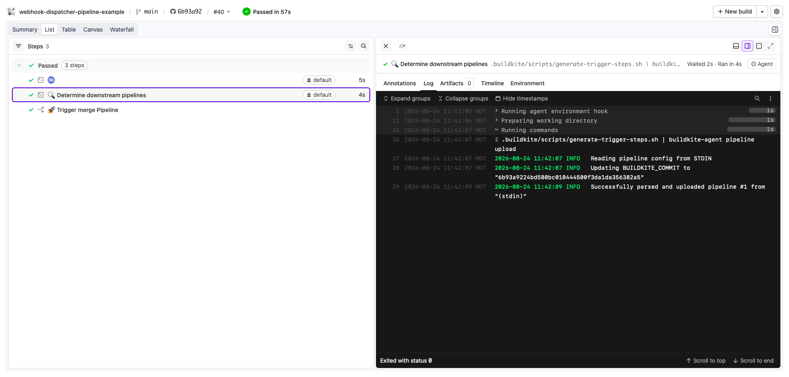
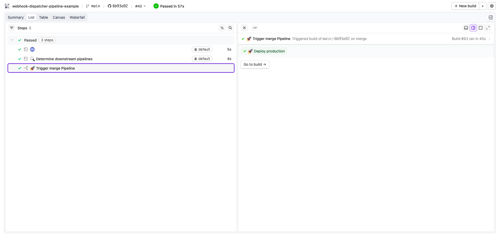

# Buildkite Webhook Dispatcher Pipeline Example

[](https://buildkite.com/buildkite/webhook-dispatcher-pipeline-example)
[](https://buildkite.com/new)

Buildkite's [GitHub webhook integration](https://buildkite.com/docs/pipelines/source-control/github) is 1:1, each pipeline that wants to build automatically on push needs its own webhook on the repo, and GitHub caps a repo at 20 webhooks. 

This repository is an example [Buildkite](https://buildkite.com/) pipeline that works around it, by fanning a single webhook out to many downstream pipelines.

👉 **See this example in action:** [buildkite/webhook-dispatcher-pipeline-example](https://buildkite.com/buildkite/webhook-dispatcher-pipeline-example)

See the full [Getting Started Guide](https://buildkite.com/docs/guides/getting-started) for step-by-step instructions on how to get this running, or try it yourself:

[](https://buildkite.com/new)

<a href="https://buildkite.com/buildkite/FIXME/builds/latest?branch=main">
  
</a>
<a href="https://buildkite.com/buildkite/FIXME/builds/latest?branch=main">
  
</a>
<a href="https://buildkite.com/buildkite/FIXME/builds/latest?branch=main">
  
</a>

## Repository layout

```
.
├── .buildkite/
│   ├── scripts/
│   │   └── generate-trigger-steps.sh       # reads routes.yml + git diff, emits `trigger` steps
│   ├── pipeline.yml
│   ├── routes.conf
│   └── template.yml
├── services/
│   ├── service-a/                          #downstream pipeline #1 (no webhook)
│   │   └── README.md
│   └── service-b/
│       └── README.md                       # downstream pipeline #2 (no webhook)
├── LICENSE
└── README.md
```

<!-- docs:start -->

## How it works

It uses one dispatcher pipeline as the single point of contact with GitHub, and fan out to as many downstream pipelines, only the dispatcher consumes a webhook slot, so the webhook limit no longer scales with pipeline count:

```
GitHub push/PR
      │
      ▼
┌─────────────────────┐
│ dispatcher pipeline │  ← the ONLY pipeline with a GitHub webhook
└─────────┬───────────┘
          │ diffs the changed paths, decides what's affected
          ▼
   ┌──────────────┬──────────────┐
   ▼              ▼              ▼
service-a      service-b     (…any number more)
(no webhook)   (no webhook)   (no webhook)
```

Only the dispatcher pipeline consumes a webhook slot. Downstream pipelines are started via trigger instead of GitHub, so the webhook limit no longer scales with pipeline count. 

Which downstream pipelines actually get triggered is controlled entirely by `.buildkite/routes.conf`. Each line maps a path in this repo to the slug of the pipeline that should be triggered when something under that path changes. On every build, the script diffs the changed files against these paths and only triggers the pipelines whose watched path actually changed. 

For example,  if nothing under `services/service-a/` changed, **service-a-pipeline** doesn't run. 

```
services/service-a:service-a-pipeline
```

## License

See [LICENSE](LICENSE) (MIT)
